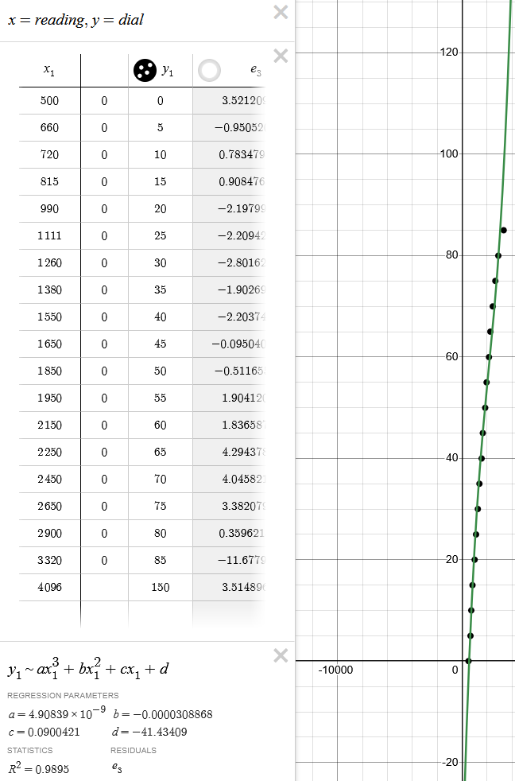

#FUNCTIONAL WIP

A multifunctional dial using on the Waveshare ESP32-S3-Touch-LCD-1.28. Current default settings are based on my specific build as detailed below as an Oil Pressure Gauge for an FA24 engine

# Pinout
3V3 to power sensor
GPIO 15 as input
USB as power in

Some 5 volt sensors work fine at 3.3v others may require a Logic Level Converter. This must be done as the GPIO15 ADC input cannot handle over 3.1v. In this case connect VSYS to 5v ref, 3V3 to 3.3v ref, Connect the sensor to one of the 5v sides of a channel and the 3.3v side to GPIO15

Wire up to the board and mount. run power and sensor as 2 pigtails out the back housing. run wires. 

# Minimum Part List
- [waveshare ESP32-S3 Development Board with 1.28inch Round Touch LCD](https://www.amazon.ca/waveshare-Development-Accelerometer-Gyroscope-Connector/dp/B0CM8L8HX2)
- [Low Profile USB C ](https://www.aliexpress.com/item/1005005372545619.html?spm=a2g0o.cart.0.0.501f38da4nZJUl&mp=1)
- Wire and Solder
#### For my specific usage 
- [Engine Galley Adapter](https://www.amazon.ca/gp/product/B09C8V8X2V?smid=A2SEQ57LRTT8C8&psc=1)
- [Honeywell Pressure Transducer](https://www.mouser.ca/ProductDetail/Honeywell/MIPAN2XX150PSAAX?qs=7MVldsJ5UawRN2htYDv0%2Fw%3D%3D) 
- [Logic Level Shifter](https://www.amazon.ca/ARTGEAR-3-3V-5V-Channels-Converter-Bi-Directional/dp/B07V1YY8FH?crid=CTENHP0MF9X9&dib=eyJ2IjoiMSJ9.CjQGOx9iCZDAHSse45UKNUaSL3rYnKiNX-VR8_hpTH7-O_ZBNZgux8S7d3LTyjnMbwzxPiKNvV1SufyKejjoFf9JX624qvYaead0trW2Ru7B9lEiIrfT-fMub88IBmkJdNbB-5y2-p7chDvibqj2H4uHJzwGPACicBqhQsGJeXp4F6dRMMQvs6Fromoa4QFgkuidQM_SGOKt3Snnpc90j6McB_-NQXz2Rv7NLOc3zYcvbr-DbvsXEfxMch4UF0fgf0T4Mk44aWRXfQyu4AMjkCRdYP5OhxjS3j2CpeaPvOug2etveiHkbiz9Qcy1kTp0jGSO7Ao4QHQlcBWcB9BNxeKvAiPhgsx5IuTPNWs3XkLN_jeXIt9Bnkj0NEmPlmimHHfUuwmeQcIJsS51Qo5p-o1b5HkA9d4hPb778LOz6o_gAxgKU42Ew5fYMQnI0tKK.ozHKnzPWshRo6H4FVDgEQNcc7nLKwrG4qMG_QZie4xI&dib_tag=se&keywords=logic+level+shifter&qid=1740014403&sprefix=logic+level+%2Caps%2C159&sr=8-5) *the honeywell unit did not operate at 3.3v*
- [Amazon Pressure Transducer](https://www.amazon.ca/Pressure-Transducer-Sender-Connector-Stainless/dp/B09WRP4DYZ?crid=7CFMSKK2K8LZ&dib=eyJ2IjoiMSJ9.IIGjJQFL_j2aXoIxiNl9oby-mMrpvZYJ3rNblYz0AZb6WQk8yXfF0qj42aS41HcIX2jC0KolqkYA7ZRHhZhy7h9JKwARQnBw8RTQnYrsRC-5xL4IFi392AdsQZFuisGMD3BcdFk-Vh1vy-8ktmg00VHpIvr0c0HRmHTAplD7iNWZ84RhW7NvAA2THUSatK1il34qfKI1xLJiykFX2yAXqRgpoqfKNpqMGyBhMR_c3OPdA5ynXOwTtFUcZoim2JMXD2fH9T3XElTp-q-4Vw8wR0qIr8K4NA2FwPUS746QfpNejFT3vYB_h36Fj-3v4RYEMZe-gm6IZNi1FwnlDpv9EgKNVytF80mucg3r5sWRetyj5hFuu67W7pl4yVZZ8Imp_ORvEicXbEdgsqti6XySiERH_RH9X0GGv7v-YynIhjQoKscvA96EbUAtihtOxitx.C0LYyVvcZ86CRWXTOHHt6o20T_DBfqDZ18bfAo7geww&dib_tag=se&keywords=oil+pressure+sensor+connector&qid=1738370546&sprefix=oil+pressure+sensor+connecto%2Caps%2C144&sr=8-8) *bought for the cable. Considering the other points of precision loss would likely be entirely adequate inplace of the honeywell unit*
####For Testing and verification
- [Dial](https://www.amazon.ca/gp/product/B0087UD156?smid=A3DWYIK6Y9EEQB&psc=1)
- [Fitting](https://www.amazon.ca/gp/product/B0B8XK29Y8?smid=A2ICOVNJJP1U27&psc=1)

## Current Features:
- Hybrid Analog Digital readout
- Toggleable colour shift on warning based on percentage of max
- Toggleable min and max per session ticks. Session resets on touch input
- Orientation sensing based on the onboard accelerometer

### Planned Features:
- Independent Digital and Analog Style Readouts
- Switch between styles/Colour palettes using the touch screen
- Update the tick labels based on higher max value readings
- Different themes

### Stretch Goals:
- Mode to show a scrolling line graph in the background
- Bluetooth companion app for time-stamped data collection

## KNOWN BUGS
- When small tick labels have 3 characters drawn a grey line gets drawn to the bottom of the screen
- Dynamic max does not centre the labels

## Guidance for libraries and enviornment set up derived from
https://github.com/y3rbiadit0/ESP32-S3-Touch-LCD-1.28-sample-pio-project

### sensor image references

