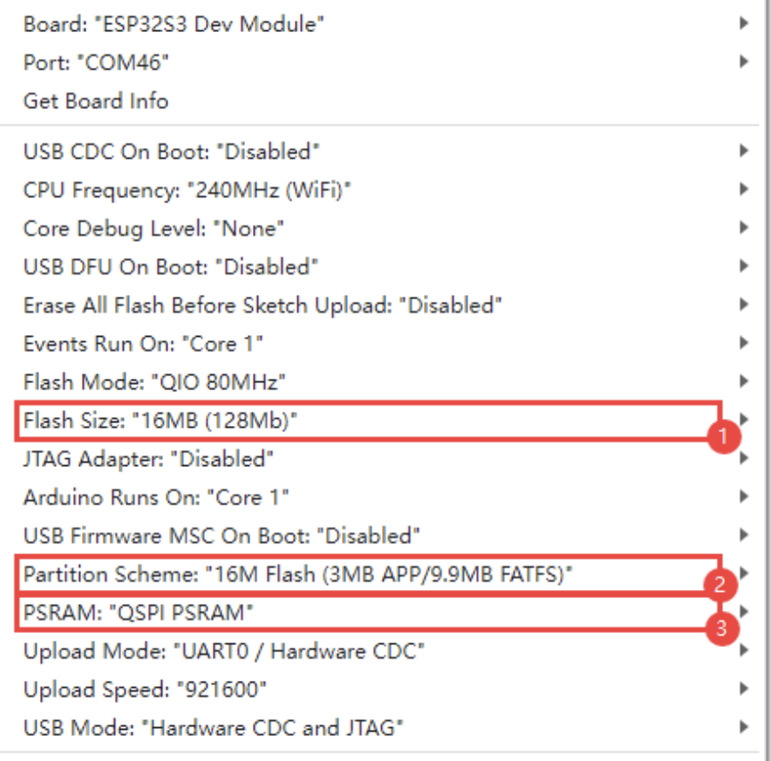

# NON FUNCTIONAL WIP

A multifunctional dial based on the Waveshare ESP32-S3-Touch-LCD-1.28.

Code and libraries adapted from the provided ESP32-S3-Touch-LCD-1.28-Test.

# Pinout
3V3 to power sensor
GPIO 15 as input
Vsys or USB as power in

Wire up to the board and mount. run power and sensor as 2 pigtails out the back housing. run wires. 

## Library list
(place libs contents into arduino libraries folder)
LVGL  8.3.10
TFT_eSPI 2.5.34
TFT_eSPI_Setups (from waveshare demo)

## Planned Features:
- Digital and Analog Style Readouts
- Switch between styles/Colour palettes using the touch screen
    -single finger changes between light and dark modes
    - dark mode red is lower brightness
    - double finger tap cycles between units
    - tap and hold switches analog vs digital readouts
- 3D printed enclosure
- User configurable sensor support
- Dynamically set max scale unit

### Stretch Goals:
- Mode to show a scrolling line graph in the background
- Bluetooth companion app for time-stamped data collection

### PSI sensor reference formula

### KNOWN BUGS
- When small tick labels have 4 characters drawn a grey line gets drawn to the bottom of the screen